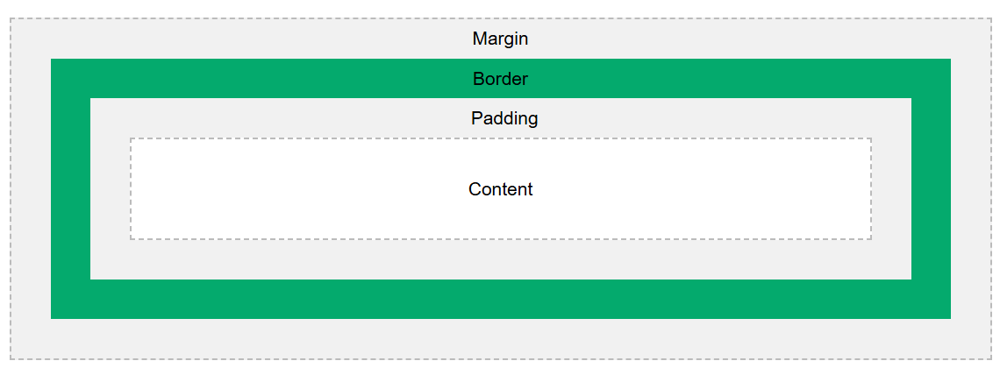

# Box Model:

The CSS box model is essentially a box that wraps around every HTML element. It consists of: content, padding, borders and margins. The image below illustrates the box model:
Content - The content of the box, where text and images appear
Padding - Clears an area around the content. The padding is transparent
Border - A border that goes around the padding and content
Margin - Clears an area outside the border. The margin is transparent

# Cascading:

CSS stands for Cascading Stylesheets. The cascade is the algorithm for solving conflicts where multiple CSS rules apply to an HTML element. It's the reason that the text of the button styled with the following CSS will be blue.

button {
color: red;
}

button {
color: blue;
}

Understanding the cascade algorithm helps you understand how the browser resolves conflicts like this. The cascade algorithm is split into 4 distinct stages.

Position and order of appearance: the order of which your CSS rules appear
Specificity: an algorithm which determines which CSS selector has the strongest match
Origin: the order of when CSS appears and where it comes from, whether that is a browser style, CSS from a browser extension, or your authored CSS
Importance: some CSS rules are weighted more heavily than others, especially with the !important rule type
