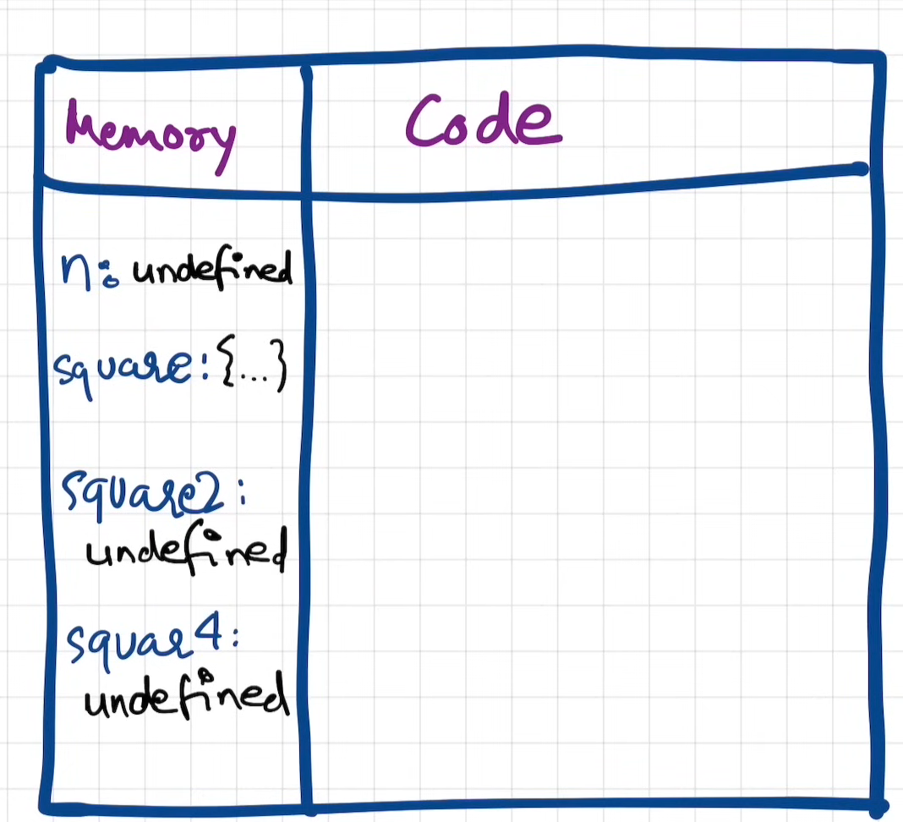
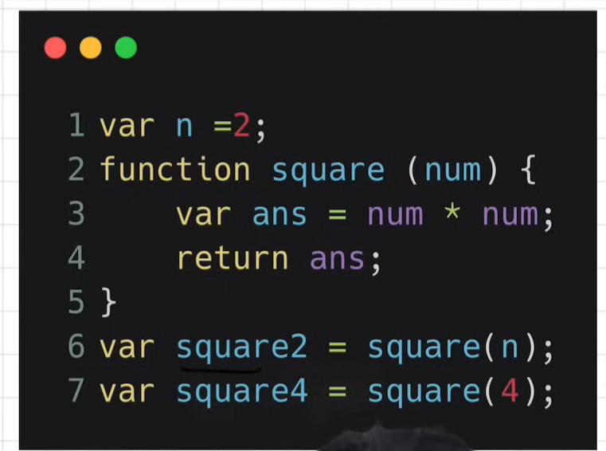
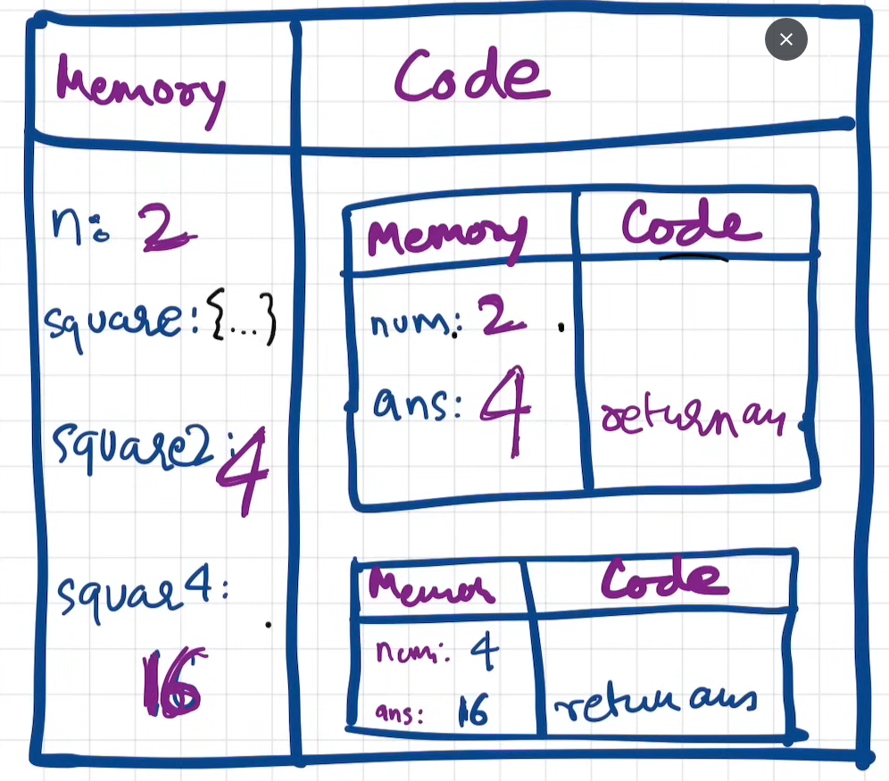

# How JavaScript works & Execution Context:

- Everything in JavaScript happens inside an execution context.
- JavaScript is a synchronous single-threaded langauage.
  

# How JavaScript code is executed? & Call stack:

- 1st phase:
  
  
- 2nd phase:
  
- Call stack maintains the order of execution of execution contexts

# Hoisting in JavaScript

- Hoisting is a phenomena in Javascript by which we can access the variables and functions even before initialized it and we have put some value in it. We can access it without any error.
- In case of proper function declaration it will store whole function code.

- NOT DEFINED: If we not allocate memory for variable.
- UNDEFINED: Memory allocated for variable but not initialized.

- In case of arrow function hoisting will not take place. Its behave just like a variable.

# How functions works in JS

- Global ececution context is created.
- Memory phase
- Code phase
- function pushed into call stack
- function poped out from call stack
- At the end GEC and call stack deleted

# Shortest JS Program, Window & this keyword

- In an empty JS file JS engime will create GEC & also sets up memory space.
- Also created window object & this keyword.
- At global scope this refer to object. (this === window is true)
- Everything which is not inside the function is in global space
