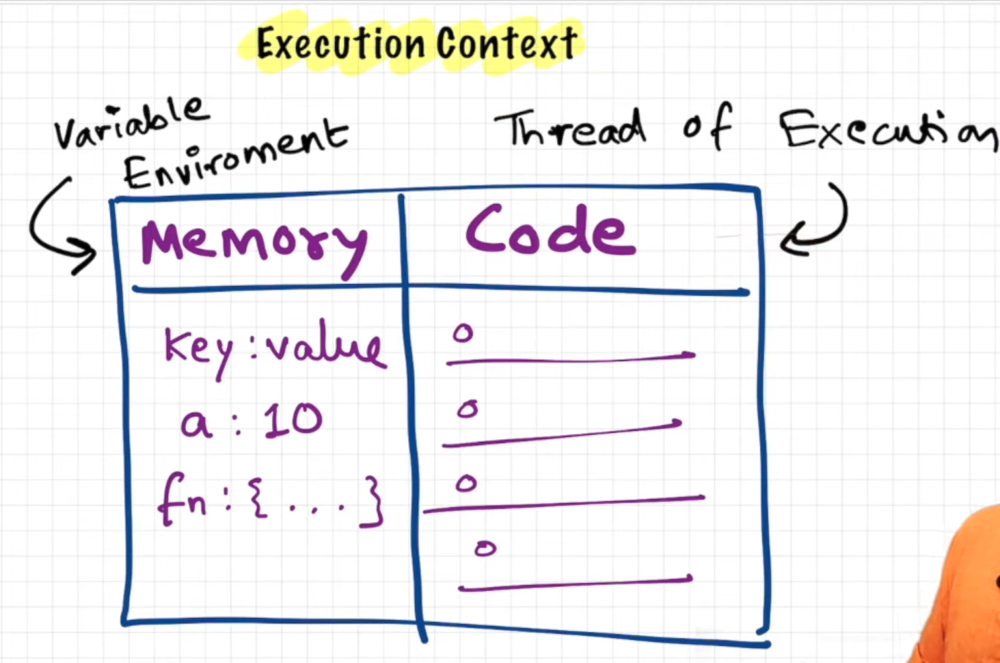
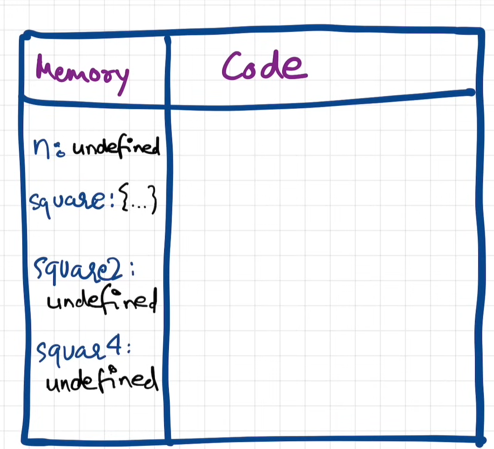
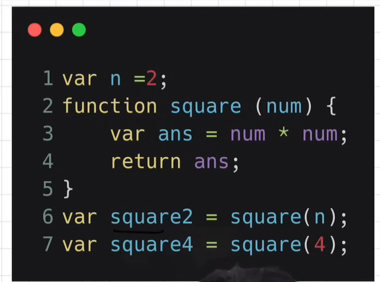
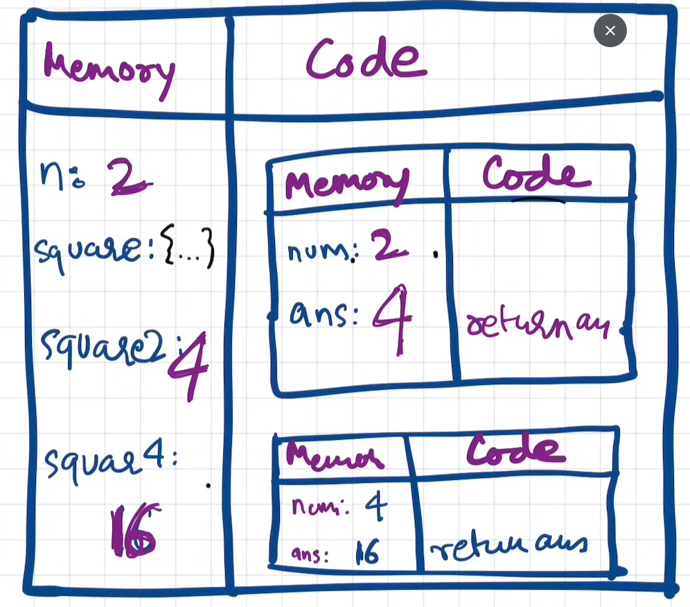

# How JavaScript works & Execution Context:

- Everything in JavaScript happens inside an execution context.
- JavaScript is a synchronous single-threaded langauage.
  

# How JavaScript code is executed? & Call stack:

- 1st phase:
  
  
- 2nd phase:
  
- Call stack maintains the order of execution of execution contexts

# Hoisting in JavaScript

- Hoisting is a phenomena in Javascript by which we can access the variables and functions even before initialized it and we have put some value in it. We can access it without any error.
- In case of proper function declaration it will store whole function code.

- NOT DEFINED: If we not allocate memory for variable.
- UNDEFINED: Memory allocated for variable but not initialized.

- In case of arrow function hoisting will not take place. Its behave just like a variable.

# How functions works in JS

- Global ececution context is created.
- Memory phase
- Code phase
- function pushed into call stack
- function poped out from call stack
- At the end GEC and call stack deleted

# Shortest JS Program, Window & this keyword

- In an empty JS file JS engime will create GEC & also sets up memory space.
- Also created window object & this keyword.
- At global scope this refer to object. (this === window is true)
- Everything which is not inside the function is in global space

# Undefined vs not defined

- If we allocate memory to any variable then js will store undefined during memory allocation phase.
- If we not allocate memory then it will throw an error of not defined.
- JS IS LOOSELY TYPE LANGUAGE. WHICH MEANS ITS NOT ATTACHES VARIABLE TO ANY DATA TYPE.

# Scope chain, Scope & Lexical environment:

- Scope in JS directly releated to lexical environment.
- Scope is where we can access specific variable and function in our code.
- Whenever EC is created a lexical enviornment is also created. Lexical enviornment is local memory along with its lexical enviornment of its parent.
- At global level lexical enviornment its points to NULL.
- Scope chain is whole chain of lexical enviornment.

# let & Const, Temporal dead zone:

- let & const declarations are hoisted.
- let & const are in different memory space than global space.
- TDZ is the time since let and const variable is hoisted and till it is initialized some value.
- Whenever we try to access let and const variable in TDZ, it will throw an error of RefeerenceError.
- We can re initialized let but not const variable also if const is not initialized it will throw an error.

# Block scope, Shadowing in JS

- Block is defined by {}. Block is also known as compound statement. Block used for bundle multiple statements together in a block to use where JS needs one statement.
- Shadowing in JS:
  var a = 10;
  {
  var a = 100;
  console.log(a)
  }
  console.log(a)
- Shadowing will not happen in case of let & const.
- var is function scope.

- Illegal shadowing:
  let a = 20;
  {
  var a = 20;
  }
- Because var a is crossing its boundary above. It will throw an error.

var a = 20;
{
let a = 20;
}

- It is legal shadowing because let a is here block scope and not crossing its block. Same happess with const variable.

# Closures:

- A function bind together with its lexical enviornment.
  function x() {
  var a = 7;
  function y() {
  console.log(a);
  }
  return y;
  }

var z = x(); // Here z have reference of a because of fn y lexical env.
console.log(z);
z();

- Uses:
  - Module design pattern
  - Currying
  - Functions like once
  - memoize
  - maintaining state in async world
  - setTimeouts
  - Iterators
  - and many more....

# setTimeout + closures interview questions:

function x() {
for (var i = 0; i <= 5; i++) {
setTimeout(() => {
console.log(i);
}, i \* 1000);
}
}
x();

- will print 6 6 6 6 6 because of closure and var. setTimeout have reference of a and when timer will end value of a became 6.

-------- Solution
function x() {
for (let i = 1; i <= 5; i++) {
setTimeout(() => {
console.log(i);
}, i \* 1000);
}
}
x();

- will print 1 2 3 4 5 because here let will create new block scope of i in every iteration.

----- Solution with var
function x() {
for (var i = 1; i <= 5; i++) {
function close(i) {
setTimeout(() => {
console.log(i);
}, i \* 1000);
}
close(i)
}
}
x();

- Disadvantage of closures:
  - over consumption of memory.
